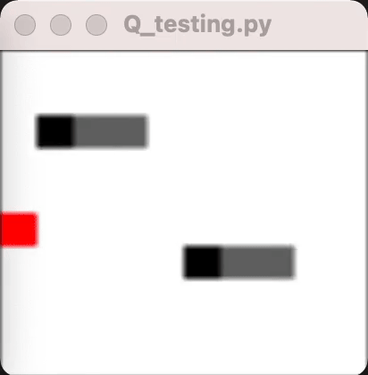

# slitherl
A Deep Q-learning implementation for the Multiplayer Snake Game. The project was completed in 2021, in response to OpenAI's Requests for Research 2.0.

The repo includesa a tensorized RL environment writtenin PyTorch to generate training data. The GIF below shows two trained agents interacting.

In the GIF, a snake was lured by a fruit before it was cornered and died. We also see the snakes learned to avoid other snakes.

